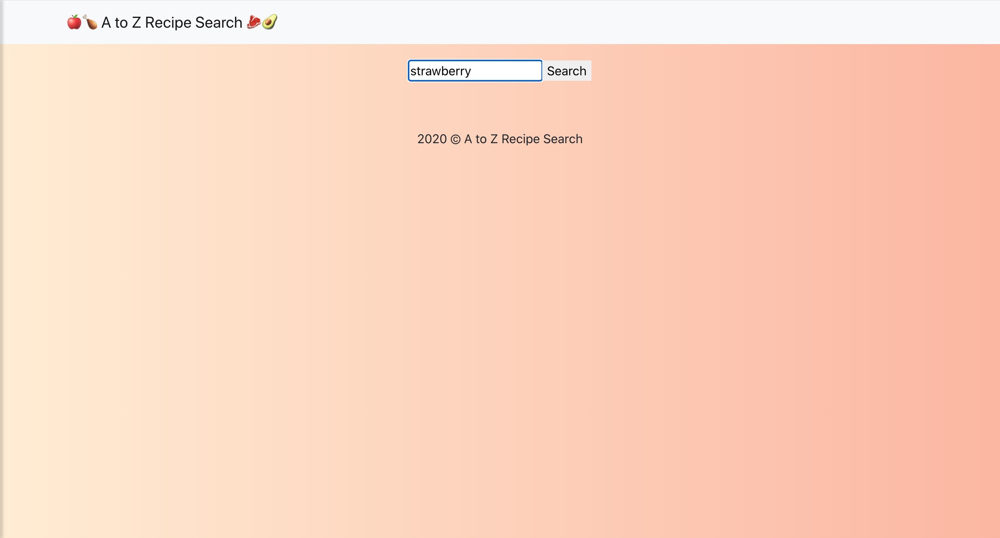
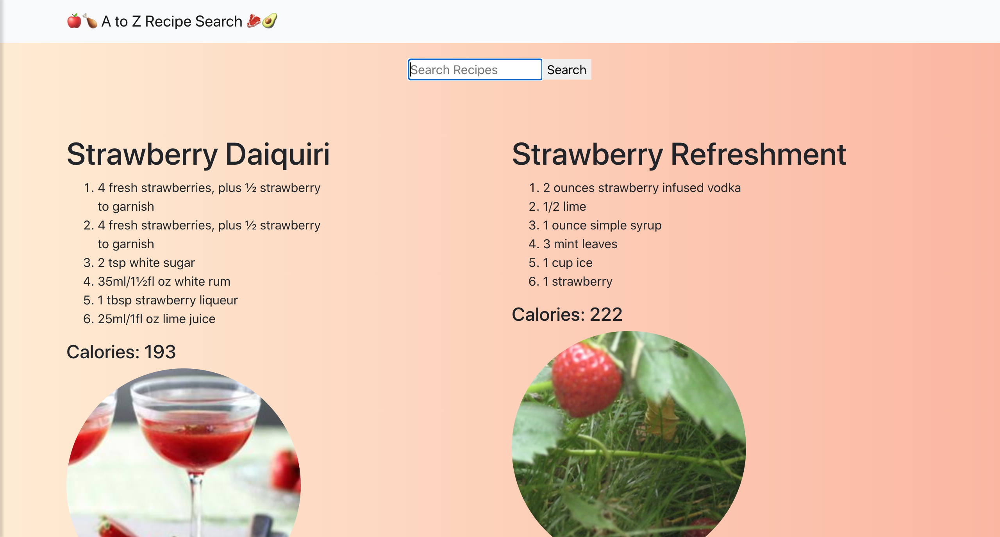

## A to Z Recipe Search

Creating a recipes app using React, reactstrap, Bootstrap ver. 4+ and the Edamam Recipe Search API.

## Instructions on how to get this application up and running

- git clone 
- npm install
- npm start

## Built With

- HTML
- CSS
- JavaScript
- Bootstrap 4.0+
- reactstrap
- Edamam Recipe Search API
- Deployed with Heroku

## Screenshots

Enter your recipe or keyword

Result